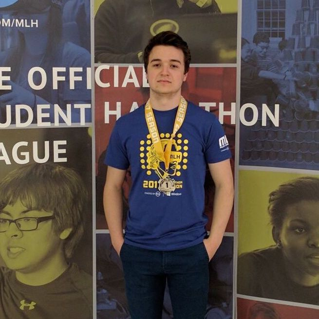

 

 

Quick <strong class="red">Bio:</strong>

I am a undergraduate student at <a href="www.na.edu">North American Univeristy</a> pursuing a Bachelor's degree in Computer Science. Currently holding a undergraduate research position University of Houston under the supervision of <a href="http://www2.cs.uh.edu/~vilalta/index.html">Dr. Ricardo Vilalta</a> -- Director of <a href="http://www2.cs.uh.edu/~vilalta/ResearchLab/">Pattern Analysis Laboratory</a>. My research interests include Artificial Intelligence, Machine Learning, Meta-Learning, Domain-Adaptaion, and Statistical Inference. 

 

Contact<strong class="red"> Information:</strong>

<ul>
<li>E-mail: <a href="mailto:m.meskhi@na.edu">m.meskhi@na.edu</a></li>
<li>Phone: +1 346-317-2386</li>
<li>Github: <a href="github.com/michaelmmeskhi">MichaelMMeskhi</a></li>
</ul>
 

Useful <strong class="red">Resources:</strong>

<ul>
<li><a href="resume.pdf">Resume</a></li>
</ul>